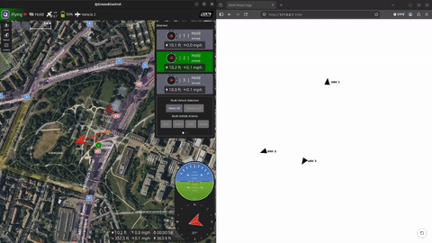

## Work in progress 
> [!WARNING]
> **SITL ONLY — DO NOT USE ON PHYSICAL HARDWARE**
> 
> This custom swarm flight mode and module are strictly designed and implemented for software-in-the-loop (**PX4 SITL**) simulation and testing purposes only. It has **not** been validated, safety-tested, or tuned for real-world physical drones. Deploying this module on operational hardware may result in unpredictable flight behavior, crashes, or severe property damage.
## Overview
Tested with PX4 v1.18.0





Clone the PX4 repository with all the submodules and then copy the content of src and msg folders of this repository to the cloned PX4.


Follow the guide internal_flight_mode in docs to create your own custom internal flight mode 


### Two MAVLINk messages are defined

    <message id="601" name="SWARM_MANAGEMENT">
      <field type="uint8_t" name="type">Type of the message</field>
      <field type="uint8_t" name="swarm_id">ID of the swarm network</field>
      <field type="uint8_t" name="no_of_nodes">Number of nodes in the network</field>
      <field type="uint8_t" name="leader_id">ID of the swarm leader</field>
    </message>

    <message id="602" name="SWARM_NODE">
      <field type="uint8_t" name="swarm_id">Type of the message</field>
      <field type="uint8_t" name="node_id">Number of nodes in the network</field>
      <field type="float" name="x">x from the leader</field>
      <field type="float" name="y">y from the leader</field>
    </message>


### Three uORB messages are defined
#### Swarm management

```python
uint64 	timestamp		# time since system start (microseconds)
uint8 type			# type of the message - initiate/delete etc.
uint8 swarm_id			# id of the swarm
uint8 no_of_nodes		# number of nodes in the network
uint8 leader_id			# id of the swarm leader
```

#### Swarm node

```python
uint64 	timestamp		# time since system start (microseconds)
uint8 swarm_id			# id of the swarm
uint8 node_id
float32 x			# relative x position
float32 y			# relative y position
```

#### Swarm Information

```python
uint64 	timestamp		# time since system start (microseconds)
uint8 swarm_id
uint8 node_id
float32 x
float32 y
float32 z
float32 yaw
```


### A MAVLink mode is defined
MAVLINK_MODE_SWARM is defined to include ATTITUDE and LOCAL_POSITION_NED messages.

## Using the web app
Start the Docker containers in docker-compose-web-app.yaml and run misc/packet_forwader.py which simulates a mesh network and is currently implemented for 3 nodes.
Select the UAVs you want and create a swarm network.


## Tests 
## swarm_3_nodes
Compile activate_swarm_3_nodes.cpp in tests/swarm_3_nodes

Add the following content in ROMFS/px4fmu_common/init.d-posix/px4-rc.mavlink:
```
set SWARM_LOCAL_PORT $((15100 + px4_instance))
set SWARM_REMOTE_PORT $((15200 + px4_instance))

mavlink start -u ${SWARM_LOCAL_PORT} -o ${SWARM_REMOTE_PORT} -m swarm -r 100000 -p
```
This opens 2 endpoints for the mavlink mode swarm that is explained above in each SITL instance. 

Compile the project and open three SITL instances with:
```
PX4_SYS_AUTOSTART=4001 PX4_SIM_MODEL=gz_x500 ./build/px4_sitl_default/bin/px4 -i 0
PX4_GZ_STANDALONE=1 PX4_SYS_AUTOSTART=4001 PX4_GZ_MODEL_POSE="0,1" PX4_SIM_MODEL=gz_x500 ./build/px4_sitl_default/bin/px4 -i 1
PX4_GZ_STANDALONE=1 PX4_GZ_MODEL_POSE="0,2" PX4_SIM_MODEL=gz_x500 ./build/px4_sitl_default/bin/px4 -i 2
```
and perfrom a takeoff for all three.

Run the python script packet_forwarder.py and execute activate_swarm_3_nodes in tests/swarm_3_nodes. ID 1 is the leader and it therefore exits the swarm flight mode automatically. Move UAV ID 1 and the other two will follow.


## swarm_virtual_leader_follower
Compile send_swarm_simulation.cpp 
Open a PX4 SITL instance with the ID 1 and perform a take off and then run compiled send_swarm_simulation.


## Reference
Wang, J., & Hu, X. (2010). Distributed Consensus in Multi-vehicle Cooperative Control: Theory and Applications (Ren, W. and Beard, R.W.; 2008) [Book Shelf]. *IEEE Control Systems Magazine*, 30(3), 85-86. https://doi.org/10.1109/MCS.2010.936430

Kuriki, Y., & Namerikawa, T. (2014). Consensus-based cooperative formation control with collision avoidance for a multi-UAV system. *2014 American Control Conference*, 2077–2082. https://doi.org/10.1109/ACC.2014.6858777


