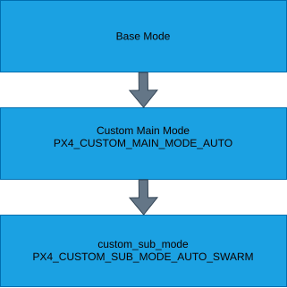

# Adding a PX4 custom internal flight mode (custom flight mode swarm is used as an example)

#### Create a flight task according to PX4 documentation
https://docs.px4.io/main/en/concept/flight_tasks

#### Extend the VehicleStatus uORB message 
One of the free flight modes given as (NAVIGATION_STATE_FREE) can be replaced in msg/versioned/VtolVehicleStatus.msg

#### Extend FlightModeManager.cpp
Update the start_flight_task function in src/modules/flight_mode_manager/FlightModeManager.cpp to include your custom flight mode.
Example:
```cpp
	if (_vehicle_status_sub.get().nav_state == vehicle_status_s::NAVIGATION_STATE_SWARM) {
		found_some_task = true;
		FlightTaskError error = FlightTaskError::InvalidTask;

#if !defined(CONSTRAINED_FLASH)
		error = switchTask(FlightTaskIndex::Swarm);
#endif // !CONSTRAINED_FLASH

		if (error != FlightTaskError::NoError) {
			matching_task_running = false;
			task_failure = true;
		}
	}

```

#### Extend enums.json

Find navigation_mode_t in src/lib/events/enums.json, add an entry for your custom flight mode, then rebuild the project so the generated enums are updated.


#### Extend mode requirements
Include your flight mode in getModeRequirements function in src/modules/commander/ModeUtil/mode_requirements.hpp
In this example, the requirements are set as follows:

```cpp
setRequirement(vehicle_status_s::NAVIGATION_STATE_SWARM, flags.mode_req_angular_velocity);
setRequirement(vehicle_status_s::NAVIGATION_STATE_SWARM, flags.mode_req_attitude);
setRequirement(vehicle_status_s::NAVIGATION_STATE_SWARM, flags.mode_req_local_position);
setRequirement(vehicle_status_s::NAVIGATION_STATE_SWARM, flags.mode_req_local_alt);
setRequirement(vehicle_status_s::NAVIGATION_STATE_SWARM, flags.mode_req_prevent_arming);
setRequirement(vehicle_status_s::NAVIGATION_STATE_SWARM, flags.mode_req_wind_and_flight_time_compliance);
```

#### Extend coversions - this maps uORB flight modes to internal navigation mode data structures
Extend the navigation_mode function in src/modules/commander/ModeUtil/conversions.hpp to support your custom flight mode. The navigation_mode_t enum values are generated from src/lib/events/enums.json, which you updated in the previous step. For example, you can extend the function as follows:

```cpp
case vehicle_status_s::NAVIGATION_STATE_SWARM: return navigation_mode_t::swarm;
```

#### Extend commander - control mode (without this, the vehicle's attitude becomes unstable)

Add a case for your flight mode in getVehicleControlMode function in src/modules/commander/ModeUtil/control_mode.cpp 

In this example, this is implemented the same way as the Orbit flight mode.

```cpp
case vehicle_status_s::NAVIGATION_STATE_SWARM:
	vehicle_control_mode.flag_control_manual_enabled = false;
	getControlMode(SetpointType::Trajectory, vehicle_control_mode);
break;
```


## Mavlink interface for flight modes (this maps MAVLink flight modes to uORB flight modes)

Update flight mode enums in src/modules/commander/px4_custom_mode.h

There 

In this example, swarm flight mode is included under PX4_CUSTOM_SUB_MODE_AUTO enum 

Extend the get_px4_custom_mode function in px4_custom_mode.h to handle your custom flight mode. For example:
```cpp
	case vehicle_status_s::NAVIGATION_STATE_SWARM:
		custom_mode.main_mode = PX4_CUSTOM_MAIN_MODE_AUTO;
		custom_mode.sub_mode = PX4_CUSTOM_SUB_MODE_SWARM;
		break;
```

Extend the switch statement in handle_command function in src/modules/commander/commander.cpp 
If you implemented your flight mode as Auto, then search for:

```cpp
case PX4_CUSTOM_SUB_MODE_AUTO_FOLLOW_TARGET:
	desired_nav_state = vehicle_status_s::NAVIGATION_STATE_AUTO_FOLLOW_TARGET;
	break;
```
							
and include your flight mode underneath. 

Test by sending a MAVLink command. See set_on_swarm_mode in tests to see how it works!





