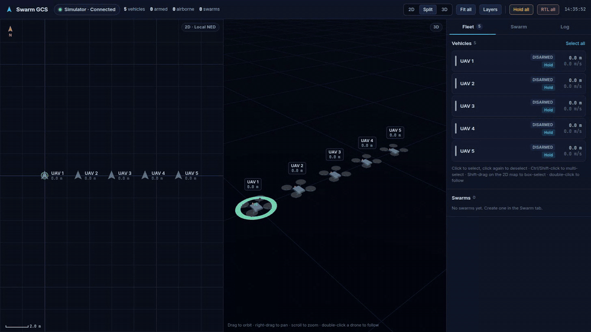
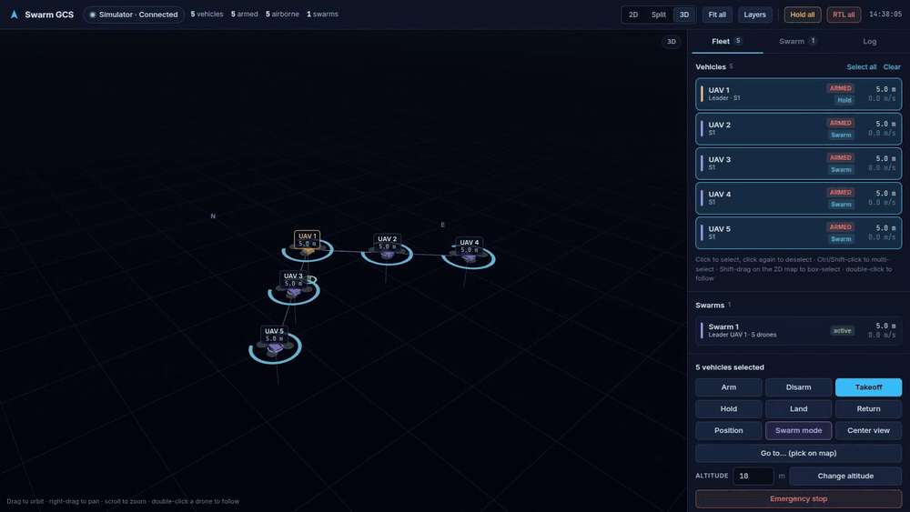
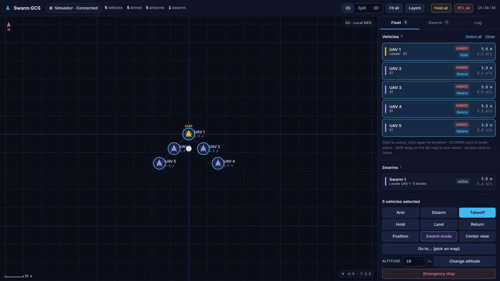
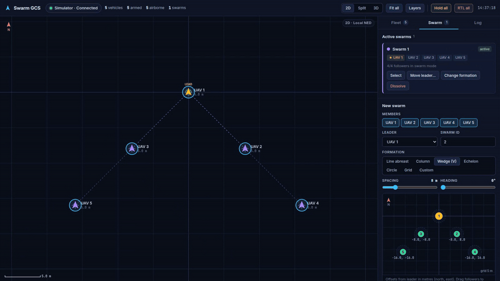

# Swarm simulation and web GCS

How to run a PX4 SITL swarm with the web ground control station, how the pieces fit together, and what to check when something doesn't work.

> SITL only. See the warning in the [README](../README.md).

## Quick start

```bash
./run_swarm_sim.sh          # 5 drones (default)
./run_swarm_sim.sh 10       # 10 drones
```

Then open **http://127.0.0.1:3000**. The pill at the top left should read **MQTT · Connected** and the Fleet tab should list the drones. Nothing takes off automatically.

| Command | What it does |
|---|---|
| `./run_swarm_sim.sh [N]` | Start N drones (1–100), the mesh relay and the web GCS |
| `-n N` or `SWARM_DRONES=N` | Same as passing N |
| `-s M` | Spawn spacing in metres (default 1) |
| `--gui` | Also open the Gazebo window (heavy; headless by default) |
| `--ros2` | Also start the ROS 2 external Swarm mode (DDS agent + one node per drone), see below |
| `--vtol` | Standard VTOLs (`gz_standard_vtol`, airframe 4004) instead of quadcopters, 5 m apart |
| `--build` | Rebuild the PX4 image first (needed after changing files under `PX4/`) |
| `status` | Show what is running |
| `logs <i>` | Follow PX4 instance *i*'s log |
| `stop` | Stop everything |

The first run after pulling changes under `PX4/` needs `--build`. That is a full PX4 compile and takes a while.

## What the script starts

1. **PX4 container** (`px4_swarm`, from `docker-compose-px4.yaml`).
2. **Gazebo and PX4 instances**, one at a time. Instance *i* is started like the manual commands:
   ```
   HEADLESS=1 [PX4_GZ_STANDALONE=1] PX4_SYS_AUTOSTART=4001 PX4_SIM_MODEL=gz_x500 \
     PX4_GZ_MODEL_POSE=<row*s>,<col*s> ./build/px4_sitl_default/bin/px4 -d -i <i>
   ```
   Instance 0 starts Gazebo; the others join it (`PX4_GZ_STANDALONE=1`). Drones spawn in rows of 10 along east: `0,0`, `0,1` … `0,9`, then `1,0` … (with the default 1 m spacing). Instance *i* has MAVLink system ID *i + 1*. Logs are in `/tmp/px4_<i>.log` inside the container.
3. **Mesh relay** `misc/packet_forwarder.py N` on the host. It relays each drone's swarm link to every other drone, simulating the mesh network. Without it, followers never hear the leader.
4. **Web GCS stack** (`docker-compose-web-app.yaml`, compose project `px4-swarm-gcs`): Mosquitto, the MAVLink ↔ MQTT bridge, and the web app.

## Architecture

```
PX4 instance i ──UDP 15200+i──▶ packet_forwarder ──UDP 15100+j──▶ PX4 instance j   (swarm mesh)
PX4 instance i ──UDP 15400+i ⇄ 15300──▶ mavlink_mqtt_bridge ⇄ Mosquitto ⇄ web GCS (browser)
                                                              1884 (MQTT)   9001 (WebSocket)
```

| Port | Used by |
|---|---|
| 15100+i / 15200+i | Swarm mesh link of instance *i* (in / out) |
| 15400+i → 15300 | Telemetry link of instance *i* to the bridge |
| 1884 | Mosquitto MQTT (bridge). Not 1883, which a system mosquitto service may already use. |
| 9001 | Mosquitto WebSocket (browser) |
| 3000 | Web GCS |

The telemetry link (`px4-rc.mavlink`) streams `ATTITUDE`, `LOCAL_POSITION_NED`, `GLOBAL_POSITION_INT`, `SYS_STATUS`, `EXTENDED_SYS_STATE` and `STATUSTEXT`; `HEARTBEAT` is always sent. The bridge sends a GCS heartbeat to every drone at 1 Hz. PX4 needs it to arm, because `NAV_DLL_ACT` is set.

### MQTT topics

| Topic | Direction | Payload |
|---|---|---|
| `uav/local_position_ned`, `uav/attitude`, `uav/heartbeat`, `uav/global_position`, `uav/sys_status`, `uav/extended_sys_state`, `uav/command_ack`, `uav/statustext` | bridge → GCS | MAVLink fields plus `sys_id` |
| `uav/command` | GCS → bridge | `{"uav_ids": [1,2], "command": "arm\|disarm\|takeoff\|land\|hold\|rtl\|position\|swarm\|goto\|kill", "params": {"north", "east", "up", "altitude"}}` |
| `uav/swarm_management` | GCS → bridge | `{"type", "swarm_id", "no_of_nodes", "leader_id", "uav_ids"?}`: `type` 1 = create, 2 = update formation |
| `uav/swarm_node` | GCS → bridge | `{"swarm_id", "node_id", "x", "y", "uav_ids"?}` |
| `uav/swarm_flight_mode` | GCS → bridge | `{"uav_ids": [...]}` (legacy, same as `command: "swarm"`) |

When `uav_ids` is given for swarm messages, the bridge sends them only to those drones, so other swarms keep running. `goto` is converted to `MAV_CMD_DO_REPOSITION` from the drone's local and global position.

## Using the GCS

### Layout



- **Top bar**: link status (click to change broker or switch to the simulator), fleet counts, 2D / Split / 3D, Fit all, Layers, Hold all / RTL all (click twice to confirm).
- **2D map**: north-up local NED. Drag to pan, scroll to zoom, Shift-drag to box-select, right-click for commands, double-click a drone to follow it.
- **3D view**: drag to orbit, right-drag to pan, scroll to zoom, double-click to follow.



- **Sidebar**: Fleet, Swarm and Log tabs.

Positions are each drone's own `LOCAL_POSITION_NED`. PX4 puts each drone's local origin where it spawned, so right after launch the drones overlap near (0, 0) even though they are apart in Gazebo.

### Fleet tab
- **Vehicles**: click to select, click again to deselect, Ctrl/Shift-click to multi-select. The selection panel has instruments, telemetry and commands: arm, disarm, takeoff, hold, land, return, position, swarm mode, go to (pick on map), change altitude, emergency stop (click twice).
- **Swarms**: click a swarm to select it, click again to deselect. With a swarm selected, right-click the map → **Fly here** moves its **leader**; the followers keep formation. Also: Go to…, Hold leader, Center view.



### Swarm tab
1. Pick members (defaults to the current selection), a leader and a swarm ID.
2. Choose a formation (line, column, wedge, echelon, circle, grid), spacing and heading, or drag followers in the editor for a custom one. Offsets are north/east metres from the leader. Pairs closer than 6 m (the APF radius) get a warning.
3. **Deploy**. The GCS:
   1. switches every member to swarm mode (the flight task only listens while active),
   2. sends `SWARM_MANAGEMENT` (the leader switches itself to Hold),
   3. sends one `SWARM_NODE` per member, 150 ms apart.

Members must be airborne first.

### Changing the formation of a running swarm



Click **Change formation** on the swarm card (or enter the existing swarm's ID in the New swarm form and click **Change formation of swarm N**), pick or draw the new formation, then click **Update formation of swarm N**. The swarm ID, members and leader stay the same (they are locked while editing). The GCS sends:

1. `SWARM_MANAGEMENT` with `type = 2` (update formation), same `swarm_id`, `no_of_nodes` and `leader_id`,
2. one `SWARM_NODE` per member with the new offsets.

No flight modes change. Each follower keeps flying the current formation while the new offsets arrive, and switches to all of them at once when the last one is in, so followers never fly a mix of old and new slots. If a `SWARM_NODE` is lost the follower simply stays in the old formation; click Update again (re-sent offsets overwrite the pending ones).

The GCS only knows swarms deployed from it; they are not restored after a page reload.

### Log tab
Command acknowledgements, `STATUSTEXT` from the drones and GCS events, with level filters.

### Built-in simulator
The GIFs on this page were recorded with it (`misc/record_gcs_gifs.py` re-records them).

`http://127.0.0.1:3000/?sim` runs 5 simulated drones in the browser with the same consensus law as `FlightTaskSwarm`. Use it to try the GCS without PX4. The page always starts on the real MQTT link otherwise; check the pill (**MQTT** vs **Simulator**) to see which you are looking at.

## ROS 2 external Swarm mode

The same swarm controller also exists as a **PX4 external flight mode written in ROS 2 Humble** ([ros2/swarm_mode](../ros2/swarm_mode)). PX4 is not modified for it: the node registers a mode called **Swarm** through [px4_ros2_interface_lib](https://github.com/Auterion/px4-ros2-interface-lib) over uXRCE-DDS, and PX4 treats it like any other mode (it shows up as an `EXTERNALn` mode, with PX4's failsafes if the node dies).

```bash
./run_swarm_sim.sh --ros2        # drones + GCS + Micro XRCE-DDS Agent + one swarm_mode node per drone
```

In the GCS **Swarm** tab pick **Swarm flight mode → ROS 2 external** before deploying. The swarm card shows **ROS 2**, and the fleet list shows **Swarm (ROS 2)** for the followers.

It behaves like the internal mode:

| | Internal (`FlightTaskSwarm`) | External (`swarm_mode` node) |
|---|---|---|
| Configuration | `SWARM_MANAGEMENT` / `SWARM_NODE` → PX4 | the same MAVLink messages → node (UDP 15600+i) |
| Neighbours | `LOCAL_POSITION_NED` / `ATTITUDE` from the mesh | the same messages, relayed by the forwarder to the node |
| Control law | consensus + APF, leader yaw/altitude | identical (ported line by line) |
| Output | velocity + yaw setpoint | `TrajectorySetpoint` velocity + yaw over DDS |
| Leader | switches itself to Hold | publishes the same `DO_SET_MODE` (Hold) over DDS |
| Formation update (type 2) | yes | yes |
| Before the formation is complete | setpoints unset | holds the position where the mode was entered |

How the pieces connect:

```
GCS ──MQTT──▶ bridge ──SWARM_* (UDP)──▶ PX4 (internal mode)
                     └─SWARM_* (UDP)──▶ swarm_mode node i (UDP 15600+i) ◀── mesh relay (neighbours)
swarm_mode node i ──HEARTBEAT (comp 191, custom_mode of its Swarm mode)──▶ bridge
swarm_mode node i ⇄ DDS (Micro XRCE-DDS Agent, UDP 8888) ⇄ PX4 instance i
```

- The node's heartbeat tells the bridge which `custom_mode` selects its Swarm mode (external mode IDs are assigned when the mode registers). The GCS sends `uav/command {"command": "swarm", "params": {"external": true}}` and the bridge switches the vehicle with that `custom_mode`.
- `px4_msgs` is generated from the PX4 image's own messages ([DockerfileROS2](../DockerfileROS2)), so the library's message compatibility check matches. Rebuild with `--build` after changing PX4 messages.
- In this repo's PX4 the internal Swarm mode sits at sub-mode 11, which moves `EXTERNAL1` to 12 (upstream: 11). The node's `external1_sub_mode` parameter (default 12) accounts for that.
- Node parameters: `px4_instance`, `sys_id`, `topic_namespace`, `mavlink_port`, `bridge_host`, `bridge_port`, `external1_sub_mode`, and for fixed-wing `fw_speed_gain`, `fw_lookahead`, `fw_airspeed_min`, `fw_airspeed_max`, `fw_height_rate_max`, `fw_rotate_offsets`, `fw_turn_rate_ff` (see `ros2/swarm_mode/src/main.cpp`). Logs: `docker logs -f swarm_ros2`.

### VTOLs: multicopter and fixed-wing phase

The node picks its output from the VTOL state (`vtol_vehicle_status`):

| Phase | Output |
|---|---|
| Multicopter (quadcopters, VTOL hovering) | the internal mode's velocity + yaw (`TrajectorySetpoint`) |
| Fixed-wing | Consensus target (average of where the neighbours put this vehicle), with offsets rotated with the leader's course. Slot velocity `v_slot = v_leader + ω × r`. The error is split along the slot's motion: **airspeed** `= ‖v_slot‖ − fw_speed_gain · e_along` (clamped to 10–20 m/s), **course** `= course_slot − atan(e_cross / fw_lookahead)`, **lateral acceleration** feedforward `‖v_slot‖ · ω`, and **height rate** from the vertical consensus + APF (`FwLateralLongitudinalSetpoint`) |
| Transition | both, as in the px4_ros2 VTOL example (transition acceleration + level flight on the current course) |

The leader's velocity comes from its `LOCAL_POSITION_NED` on the mesh; its course and turn rate are derived from it (using the leader's own timestamps). The slot velocity is fed forward because a fixed-wing cannot slow to zero at its slot. Splitting the error into along-track (speed) and cross-track (course) is what keeps the followers stable when the slot turns; flying the direction of "slot velocity + gain · error" oscillated in loiters.

Safety limits: the turn-rate estimate is clamped to ±0.35 rad/s and low-pass filtered, the lateral-acceleration feedforward to g·tan 30° (≈ 5.7 m/s²), and the turn term ω × r to half the leader's speed. Without them a spike in the estimate (the leader entering its loiter) commanded 11.5 m/s², banked a follower to 53° and it crashed in SITL.

In fixed-wing phase **the formation is relative to the leader's direction of travel**: in the GCS formation editor "up" (north) means *forward* and "right" (east) means *right of the leader*. A wedge therefore always trails behind the leader. Set `fw_rotate_offsets:=false` to keep the internal mode's fixed north/east offsets.

**Keep the formation feasible in turns.** On a turn of radius R at airspeed V, a slot at lateral distance d must fly at V·(R ± d)/R, which has to stay inside the airspeed band:

  d ≤ R · min(V_max/V − 1, 1 − V_min/V)

With PX4's defaults (V = 15, V_min = 10, V_max = 20 m/s) and the default loiter radius of 80 m, that is d ≲ 27 m. If the leader loiters (Hold) with a wider formation, the outer follower cannot keep up and the consensus coupling makes the others oscillate; use a smaller lateral spacing or a larger `NAV_LOITER_RAD`.

PX4's fixed-wing position controller does not run in external modes, and PX4 only accepts fixed-wing setpoints while the vehicle is a fixed-wing. The pinned `px4_ros2_interface_lib` therefore gets a small patch ([ros2/patches](../ros2/patches)): a setpoint type PX4 rejects for the *current* vehicle type at registration (a VTOL registers in multicopter phase) is a warning instead of an error. PX4 checks the type again when it is applied after the transition.

**VTOL controls in the GCS.** When the selection contains VTOLs, the Fleet command panel adds:

- **Takeoff & transition to FW** (`MAV_CMD_NAV_VTOL_TAKEOFF`): each VTOL climbs vertically, transitions along its heading and loiters `Loiter ahead` metres in front of it. Every VTOL gets its own altitude layer (`Altitude` + i · `Step`, default 40 / 55 / 70 m …). PX4 loiters after this takeoff at `takeoff + VTO_LOITER_ALT` (the same for all vehicles), so the bridge sets `VTO_LOITER_ALT` of each vehicle to its layer before the takeoff. This changes that parameter on the vehicle.
- **To FW / To MC** (`MAV_CMD_DO_VTOL_TRANSITION`).

The fleet list shows the VTOL phase (`MC`, `FW`, `→ FW`, `→ MC`), and the 3D view draws VTOLs as a fixed-wing VTOL (fuselage, wing, tail, four lift rotors, pusher). The lift rotors spin in multicopter phase, the pusher in fixed-wing.

Note: PX4's *internal* Swarm mode does not fly a VTOL in fixed-wing phase (flight tasks do not run in fixed-wing). Use **ROS 2 external** for fixed-wing swarms.

Test procedure (3 VTOLs):

```bash
./run_vtol_sim.sh          # = ./run_swarm_sim.sh 3 --vtol --ros2
```

1. Select all → **Takeoff & transition to FW** (separate altitude layers are the default). Manually: Takeoff, Change altitude per VTOL (e.g. 40, 55, 70 m), then **To FW**. In Hold a fixed-wing loiters around its own position, so VTOLs at the same altitude collide after the transition.
2. Wait until the fleet list shows `FW` for all.
3. Deploy with **ROS 2 external** (lateral spacing within the turn limit below). The followers join the leader's altitude.
4. Move the leader with **Fly here** / Go to.

SITL results (3 VTOLs, wedge 30 m back / 30 m to each side, leader at 15 m/s):

| Leader | Wedge | Result |
|---|---|---|
| Straight leg | 20 m | 3–8 m from the slot, wedge trails the leader |
| Loiter, R = 80 m | 20 m (feasible) | inner follower converged to < 1 m; outer follower closes at ~1.25 m/s (its slot needs 18.75 of the 20 m/s maximum), 64 → 24 m in 60 s |
| Loiter, R = 80 m | 30 m (infeasible, > 27 m) | outer follower cannot keep up (needs 20.6 m/s), inner one needs 9.4 m/s (< 10) |

With `fw_rotate_offsets:=false` (fixed north/east offsets, like the internal mode) the loiter is easy (all slots move with the leader, 9–12 m), but the formation shape is tied to the compass instead of the direction of travel.

## PX4 changes in this repo

- **Formation update** (`SwarmManagement.msg`, `FlightTaskSwarm`): `SWARM_MANAGEMENT.type` now has meaning. `TYPE_CREATE = 1` keeps the old behaviour. `TYPE_UPDATE_FORMATION = 2` for the swarm a node already belongs to collects `no_of_nodes` new `SWARM_NODE` offsets in a pending list and swaps them in atomically, keeping the neighbours' last known positions so the control output does not jump. An update for a swarm the node is not in is treated as create. No MAVLink fields changed, so no header regeneration is needed.
- **Neighbours without a position yet** are ignored by the control law (previously their uninitialised position was used until the first message arrived). Node lists are freed properly on reset.

- **Follower yaw** (`mavlink_receiver.cpp`, `SwarmInformation.msg`, `FlightTaskSwarm.cpp`): position and attitude messages from neighbours each filled only half of an uninitialised `swarm_information`. So position messages carried a random yaw that overwrote the followers' reference yaw. Unused fields are now NaN, the topic has a queue of 32, and the task reads every queued message.
- **Extra telemetry streams** on the bridge link (`px4-rc.mavlink`) for go-to, battery and status text.

Both need a PX4 rebuild (`./run_swarm_sim.sh --build`).

## Troubleshooting

| Symptom | Cause / fix |
|---|---|
| Page shows 5 fake drones | You are on the simulator. Open `http://127.0.0.1:3000/` (without `?sim`) or pick MQTT bridge in the connection menu. |
| `http://127.0.0.1:3000` does not load | The web stack starts after all drones boot. Check `./run_swarm_sim.sh status`. Port 3000 must be free. |
| "container 'px4_swarm' belongs to compose project …" | Another project uses that container name. Stop it first. |
| "Preflight Fail: barometer missing / Found 0 compass", "BARO/MAG #0 failed: TIMEOUT" | Gazebo transport discovery over Wi-Fi multicast drops subscribers, so lazy sensors stop publishing. `GZ_IP=127.0.0.1` in `docker-compose-px4.yaml` fixes it; recreate the container if it predates that change. |
| "Preflight Fail: No connection to the GCS" | The bridge is not running (its heartbeat is required). |
| Bridge connects but no drones appear | Check that PX4 streams to UDP 15300 and nothing else holds that port. `docker logs mavlink_bridge` lists discovered drones. |
| Go to fails with "no global position yet" | The PX4 image predates the extra telemetry streams; rebuild with `--build`. |
| Followers do not follow | The packet forwarder must be running with the right drone count, and all members must be in swarm mode before deploy. |
